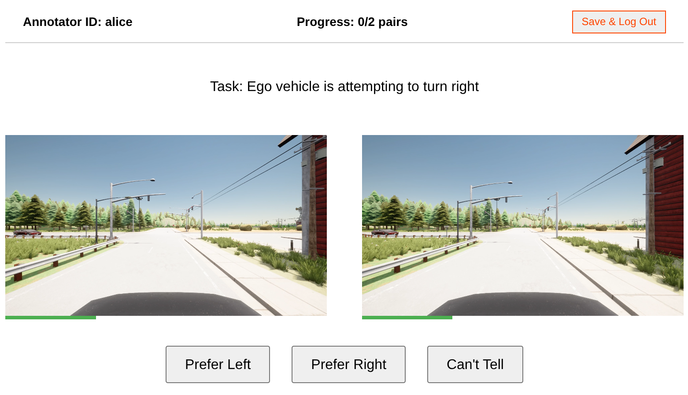

# Human Preference Annotator

A lightweight web-based tool for collecting human preference labels on driving behavior. Annotators are shown two short video clips of driving scenarios side by side and asked to choose which one they prefer or indicate if they can't tell.

<p align="center">
  
</p>

Designed for crowdsourced studies or in-lab annotation, with static frontend + serverless-ready backend architecture.

---

## Features

- Side-by-side video comparison interface with 3-button annotation UI (left / right / can't tell)
- Configurable video pair list via JSON
- Stores results in MongoDB (or as flat files)
- Local development with optional transition to S3/CDN

---

## Local Setup

```bash
git clone https://github.com/jkli-2/human-preference-annotator.git
cd human-preference-annotator

# Install backend dependencies
cd backend
npm install
# Edit .env with your MongoDB URI

# Start backend server
npm run dev

# Open frontend (use live-server or VS Code extension, or Python http.server)
cd ../frontend
python3 -m http.server 8000

# To export annotation to JSON, visit
localhost:3000/api/expxort
```
